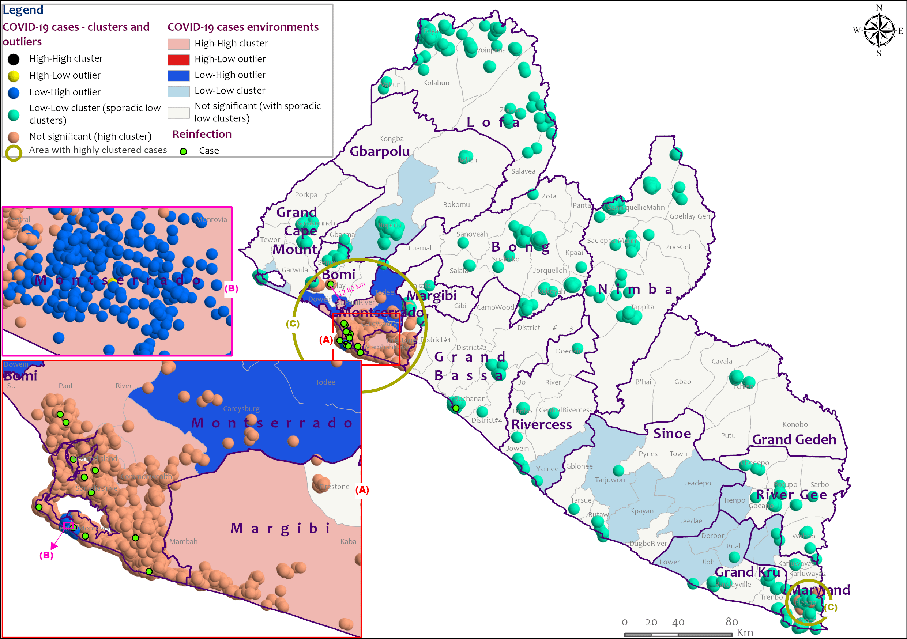

# 🔁 COVID-19 Reinfection Clusters — Liberia

## Overview
Identifies spatial clusters of COVID-19 reinfections using:

- Kernel Density Estimation (KDE)  
- Temporal stratification  
- Urban–rural gradient analysis  

## Outputs
- Reinfection density maps  
- Hotspot evolution maps  

## Maps Included

## Next Steps
- Add spatio-temporal scan statistics (SaTScan)  
- Compare primary vs secondary reinfection clusters  
# Placeholder - content coming soon
